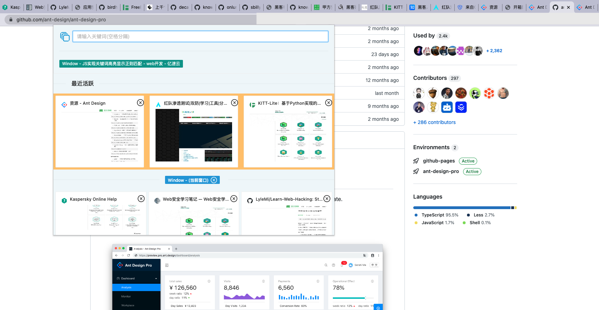
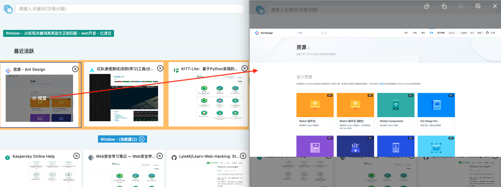
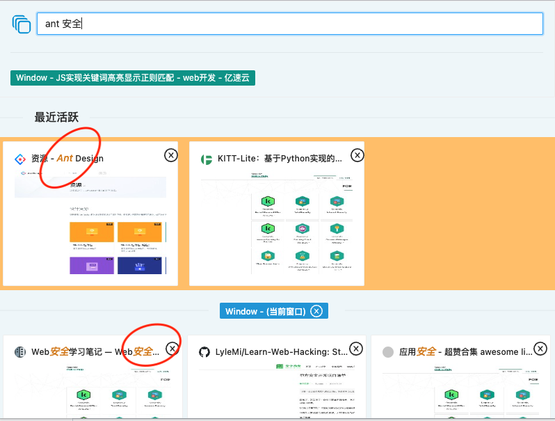
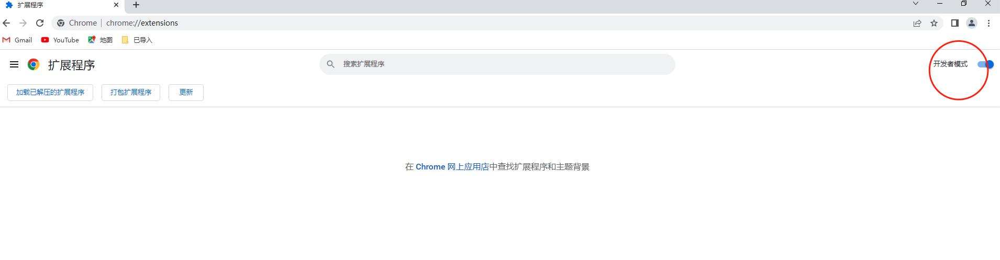
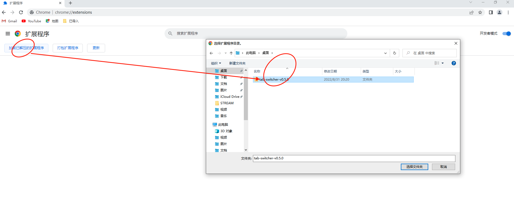
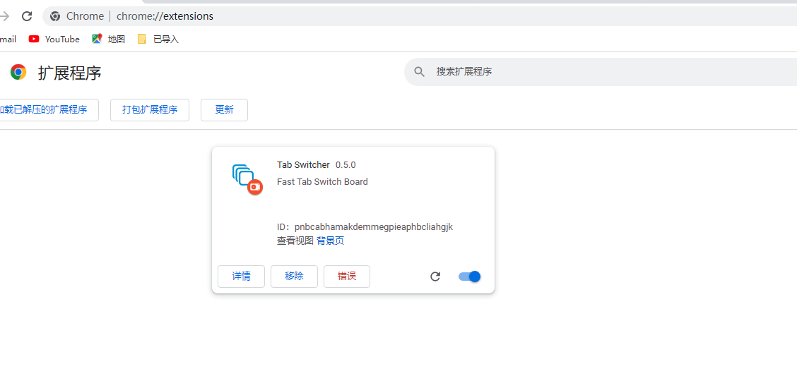
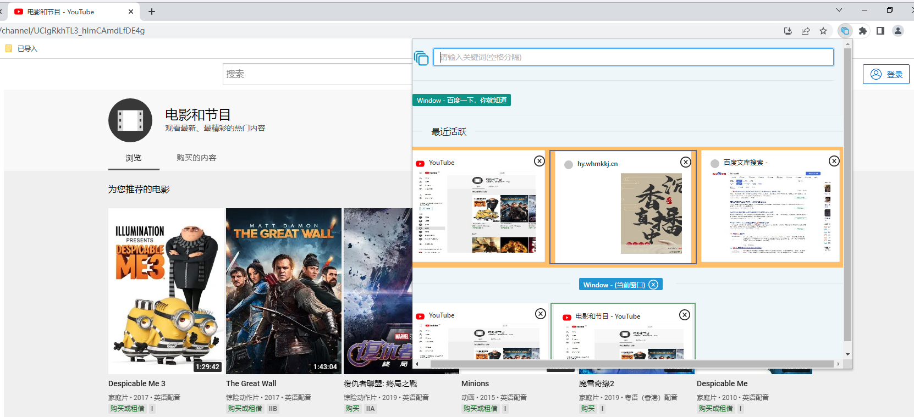

# Tab Switcher 标签切换器

日常工作中，经常需要打开多个窗口、数十个网址同时工作，此时很难快速定位和切换目标标签，需要不断的尝试点击、查看，这是一项冗余、重复、大量的工作。

Tab Switcher 借鉴系统级的 Dock 应用程序切换机制，利用 Chrome Extension 机制，实现极速、高效、智能的标签预览和切换，可以节省海量无意中损耗的时间，从而专注于更富创作力的工作。

### 功能

#### 多窗口、标签统一展示面板

无需逐个窗口、标签点击、寻找

#### 快速操作（预览等）

无需切换到目标窗口、标签即可快速预览、跳转（点击标题或图标）、关闭

#### 关键字快速匹配

支持多关键字匹配，快速定位目标或定制跨窗口的场景化工作区

#### 性能 & 隐私

优化后的压缩算法和策略，在保证功能的前提下尽可能的降低内存等硬件资源。且无任何网络操作，不会采集和上传任何数据。

### 安装

#### chrome 应用商店安装（进行中）

#### 开发模式安装包

- 下载并解压 `tab-switcher-v0.5.0.zip` 后，复制到软件安装目录
- 打开 chrome 开发者模式

- 加载插件

- 快捷键 `Alt + p`

