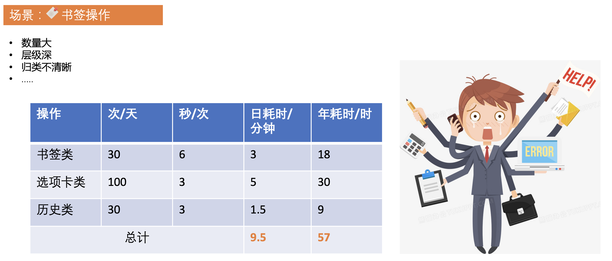
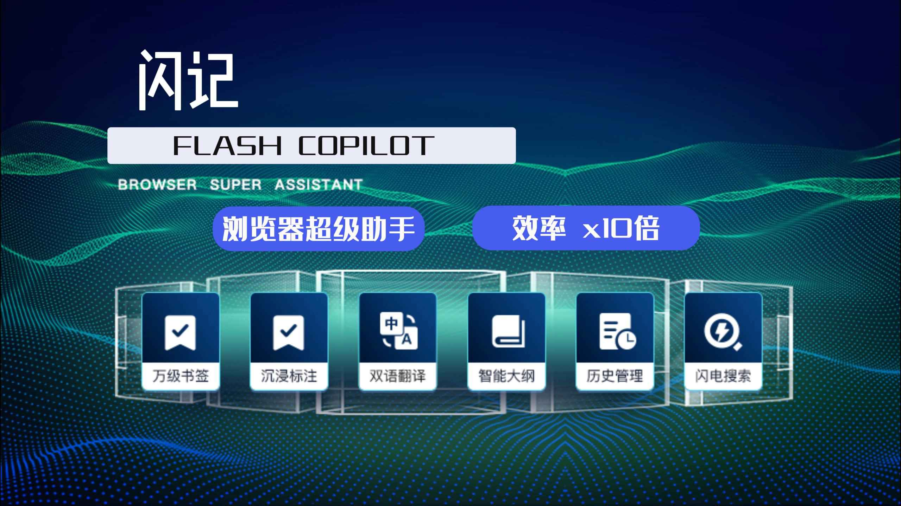
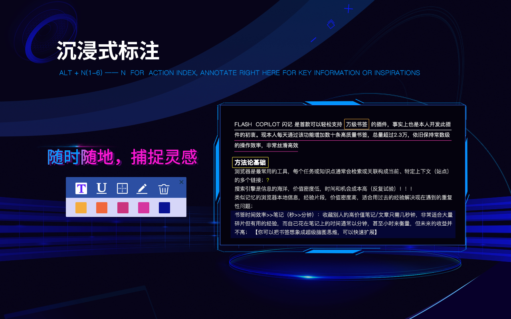

# Flash Switcher 闪电切换器

Flash Switcher 是一个专注于提高浏览器操作效率、体验的工具，聚焦最常用的多选项卡 Tab 切换、千级甚至万级书签检索、以及海量的搜索历史，践行"现在有用的，将来大概率有用的(第二大脑🧠)"理念，实现任意数量 Tab、书签、历史的常数级、沉浸式操作，提升效率，节省海量的毛细时间。

- [Chrome 商店](https://chrome.google.com/webstore/detail/flash-switcher/klokphhomfboclhpijjcgbpdjoccaagc?hl=zh-CN&authuser=0)
- [详细设计和使用文档](https://juejin.cn/column/7165324589038305294)

